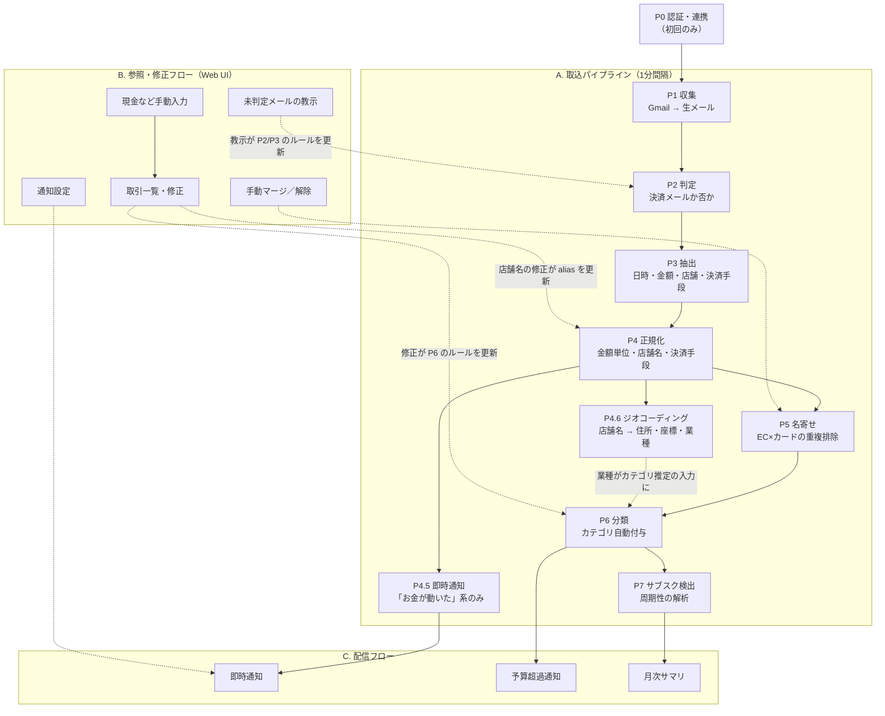

# Step0: パイプライン整理

テーマ: [決済メール解析による自動家計簿サービス](./theme-kakeibo.md)（Go）
位置づけ: **提出物ではない**。DB 仕様書・ER 図・API 仕様書すべての根拠となる作業ドキュメント。

> このドキュメントで決めること
> 1. データが Gmail から通知・月次サマリまで、**どの工程を通るか**
> 2. 各工程の **入力 / 処理 / 出力 / 冪等性 / 失敗時の扱い**
> 3. その結果として **どのテーブルが必要か**（→ Step1 へ）
> 4. その結果として **どの画面・API が必要か**（→ Step3 へ）

---

## 0. このアプリの形

**「家計簿アプリ」ではなく、「パイプライン + 校正台」。**

一般的な家計簿アプリの中心は入力画面だが、本アプリには入力画面が存在しない。
これは提案時の課題定義「手入力型は継続が難しく、数週間で使わなくなる」に対する直接の答えである。

画面の役割は 3 つだけ:

1. **結果を見る** — 月次内訳、サブスク一覧、予算残
2. **機械の間違いを直す** — 疑似重複の確認、未判定メールの教示、カテゴリ修正
3. **機械に見えないものを補う** — 現金取引の手動入力

**ユーザとの主な接点は通知（プッシュ）であり、画面（プル）ではない。**

| | sns-camp（講座サンプル） | 本アプリ |
|---|---|---|
| データの発生源 | ユーザの入力 | 外部（メール） |
| 主要な処理 | CRUD | パイプライン |
| UI の役割 | 価値そのもの | 確認と訂正 |
| 使用頻度 | 毎日 | 通知を受け取るたび + 月数回 |
| 主要な出力 | 画面 | 通知メール |
| **失敗の形** | エラー画面 | **静かに間違ったデータ** |

最後の行が重要。**本アプリの故障は無音で起きる。** カード会社がメールのテンプレートを変更する
→ 解析が失敗する → そのカードの支出が記録されなくなる → **本来あるべきものが分からないので気づけない。**

→ **可観測性は運用の話ではなく、プロダクトの機能である**（→ Step12 非機能要件へ）。

---

## 1. 全体像

3 つのフローに分かれる。

| フロー | 起動方法 | 性質 |
|---|---|---|
| **A. 取込パイプライン** | 定期実行（1 分間隔）／手動トリガ | 非同期・冪等・再実行可能 |
| **B. 参照・修正フロー** | Web UI からのユーザ操作 | 同期・CRUD |
| **C. 配信フロー** | 決済検知時／閾値超過時／月次スケジュール | 非同期・副作用あり（通知送信） |



**重要な性質**: B（ユーザの修正）が A（自動処理）のルールにフィードバックされる。
これが「手入力型は続かない」という課題への答えで、**修正するほど自動化精度が上がる**設計にする。

---

## 2. 取込パイプライン 各工程

### P0. 認証・連携（初回のみ）

| 項目 | 内容 |
|---|---|
| 入力 | ユーザ操作 |
| 処理 | ① アプリへのログイン ② Gmail アカウントの連携 |
| 出力 | `users` / `mail_accounts`（トークンは暗号化して保存） |

**設計上の含意**

- 認証が **2 種類ある**。混同しないこと。
  - **アプリ認証**: このアプリを使う権利（Bearer / JWT）
  - **Gmail 連携認証**: メールを読む権利（Google OAuth / IMAP アプリパスワード）
- 1 ユーザが複数のメールアカウントを連携しうる → `users` 1 — N `mail_accounts`
- Gmail `readonly` は **restricted scope**。Testing 状態のままだと refresh token が短期間で失効するため、
  取込層の実現方式は 3 案から選ぶ（→ 6. 未決事項 ①）
- **スキーマはマルチテナント（全業務テーブルに `user_id`）、運用はシングルユーザ**。
  後から `user_id` を足すのは高くつくため、最初から入れる。

---

### P1. 収集（Fetch）

| 項目 | 内容 |
|---|---|
| 入力 | `mail_accounts` + 前回同期位置（カーソル） |
| 処理 | Gmail からメールを取得。初回は **過去 12〜24 ヶ月をバックフィル**、以降は差分のみ |
| 出力 | `email_messages`（生データ） |
| 実行間隔 | **1 分**（即時通知のため。→ 6. 未決事項 ①） |
| 冪等性 | **Gmail message ID に UNIQUE 制約**。再取得しても重複行が増えない |
| 失敗時 | 途中失敗しても取得済み分は残す。**カーソルは成功時のみ前進** |
| 実行記録 | `sync_jobs`（開始/終了時刻、状態、取得件数、カーソル前後、エラー内容） |

**設計上の含意**

- 初回バックフィルは必須。理由は 2 つ:
  - **技術的理由**: P7 サブスク検出は履歴がないと動かない
  - **プロダクト的理由**: 連携直後に「過去 12 ヶ月の家計簿ができました」となる。
    他の家計簿アプリは初日が空なので、これが最大の差別化点であり、発表時の見せ場でもある。
- `email_messages` は **生データを保持する**。後段（P2〜P6）のロジックを変更したら
  全件再計算できる、というのがこの設計全体の前提。
- 保存する項目: 送信元・宛先・件名・受信日時・本文（text / html）・Gmail message ID。
  本文をどこまで保持するかはプライバシーとサイズのトレードオフ（→ 6. 未決事項 ②）
- **1 分間隔で実行するため `sync_jobs` は 1 日 1440 行になる。**
  変化のなかった実行は記録しないか、軽量な別テーブルに逃がす（→ 6. 未決事項 ⑤）

---

### P2. 判定（決済メールか否か）

| 項目 | 内容 |
|---|---|
| 入力 | `email_messages` のうち未判定のもの |
| 処理 | 送信元アドレス + 件名パターンを `parser_templates` と照合 |
| 出力 | `email_messages.classification` = `payment` / `not_payment` / `unknown` |
| 冪等性 | 判定は純関数。ルール変更時は再判定できる |

**3 段階のマッチング**

1. **送信元アドレス**の allowlist（高精度・第一段階）
2. **件名パターン**（同一送信元の販促メールを除外。例: 楽天カードは利用通知も広告も送ってくる）
3. どちらにも当たらない → **`unknown` として捨てずに残す**

**設計上の含意**

- 小山さんの指摘「メールが決済か決済じゃないかを判定するのがちょっ大変かも」への回答が **段階 3**。
  完璧な自動判定を目指さず、**取りこぼしを UI に出してユーザに教えてもらう**（→ B2 画面）。
- 誤って `not_payment` にすると永久に気づけないので、**迷ったら `unknown` に倒す**。

---

### P3. 抽出（Extract）

| 項目 | 内容 |
|---|---|
| 入力 | `classification = payment` のメール + マッチした `parser_templates` |
| 処理 | テンプレートの抽出ルール（正規表現 / HTML セレクタ）を適用 |
| 出力 | `payment_events`（日時・金額・通貨・生の店舗名・決済手段ヒント・イベント種別） |
| 失敗時 | 抽出失敗を記録し `unknown` キューへ。**1 通の失敗が実行全体を落とさない** |

**設計上の含意（重要）**

- **1 通のメールから複数の決済イベントが出ることがある。**
  例: 銀行の入出金まとめ通知、カード会社の月次確定通知。
  → `email_messages` **1 — N** `payment_events`
- **イベント種別を持つ。** これは金額の確からしさの判定（P5）と、
  即時通知の対象を絞る判定（P4.5）の **両方で使う中心的な列**。

  | event_type | 例 | 金額の確からしさ | 即時通知 |
  |---|---|---|---|
  | `order_confirm` | EC の注文確認 | 低（後で変わる） | ❌ まだお金は動いていない |
  | `usage_notice` | カード利用速報 | 中（未確定） | ✅ |
  | `settlement` | カード確定明細 | **高** | ❌ 速報時に通知済み |
  | `receipt` | サブスク領収書 | 高 | ✅ |
  | `bank_debit` | 銀行引落通知 | 高 | ✅ |

**日本語メール特有の処理**

- 文字コード: **ISO-2022-JP** が現役。Go 標準では読めないので `golang.org/x/text/encoding/japanese` が必要
- 転送符号化: quoted-printable / base64
- HTML メール（表組みで金額が入っている）→ テキスト化
- 全角数字の金額（`１，２３４円`）

**テンプレートをどう作るか（AI の使いどころ）**

> 遠藤さんのコメント「パワーで正規化するか、AI にぶん投げるか」への回答。

**実行時ではなく、テンプレート生成時に AI を使う。**

```
未知の送信元を検知
  → LLM に「このメールから日時・金額・店舗を抜く抽出ルール」を生成させる
  → 人間が 1 回レビュー
  → parser_templates に保存
  → 以降の実行時は決定論的に解析（LLM を呼ばない）
```

利点:
- コストがほぼゼロ（送信元の種類ぶんしか呼ばない）
- テスト可能・再現可能
- **個人の金融データを毎日外部 LLM に送らずに済む**

---

### P4. 正規化（Normalize）

| 項目 | 内容 |
|---|---|
| 入力 | `payment_events`（抽出直後） |
| 処理 | 金額・日時・店舗名・決済手段をシステム内の表現に揃える |
| 出力 | `payment_events` の正規化列 + `merchants` / `merchant_aliases` の更新 |

**4 つの正規化**

| 対象 | 処理 |
|---|---|
| 金額 | **`bigint` の最小単位**（円なら 1 = 1円）で保持。浮動小数点は使わない。外貨は「原通貨 + 原金額 + 円換算額」の 3 点で持つ |
| 日時 | タイムゾーン付きで保持。**「何月の支出か」は JST で判定** |
| 店舗名 | 生の文字列 → `merchant_aliases` を引く → なければ正規化して `merchants` に新規作成し alias を張る |
| 決済手段 | テンプレート + メール中のカード下 4 桁などから `payment_methods` を解決 |

**店舗名正規化でやること**

- 全角 → 半角、大文字小文字の統一、記号・空白の詰め
- 法人格の除去（`株式会社` / `(株)` / `カ)` ）
- アクワイアラ由来の接頭辞・接尾辞の除去（`SQ *` / `PAYPAL *` / `AMZN Mktp JP` / 末尾の店舗コード）

**merchant の粒度（重要な設計判断）**

`merchants` の 1 行は **支店単位**とし、`brand_name` 列でチェーンを束ねる。

| id | brand_name | name | address | place_types |
|---|---|---|---|---|
| 1 | セブン-イレブン | セブン-イレブン渋谷道玄坂店 | 渋谷区… | convenience_store |
| 2 | セブン-イレブン | セブン-イレブン新宿三丁目店 | 新宿区… | convenience_store |

- 地図表示は支店単位で出せる
- 「セブンで今月いくら」は `GROUP BY brand_name` で取れる
- **カテゴリ規則は `brand_name` に紐づける** → 1 回教えれば全支店に効く

正攻法は `brands` テーブルを分けることだが、テーブル数と「1 Step 1 週間」の制約を踏まえ、
今回は**列で持つ**。この取捨選択自体が「設計判断」の題材になる。

**設計上の含意**

- **`merchants` と `merchant_aliases` を分ける**のが肝。
  「アマゾン ジャパン」「AMAZON.CO.JP」「AMZN Mktp JP」が同じ `merchants` 行を指す。
  この alias テーブルが **P5 名寄せの精度と P4.6 のAPI呼び出し回数を直接決める**。
- ユーザが UI で店舗名を直したら → alias を張り直す → 次回から自動で正しくなる（フィードバックループ）

---

### P4.5 即時通知（Notify）

> 「使った瞬間に自覚する」ための工程。月次サマリ（P8）とは役割が異なり、**両方を持つ**。

| 項目 | 内容 |
|---|---|
| 入力 | 正規化済みの `payment_events` のうち未通知のもの |
| 処理 | イベント種別で対象を絞り、`notification_settings` を適用して送信 |
| 出力 | 通知の送信 + `notifications`（送信履歴）+ `payment_events.notified_at` |
| 冪等性 | `notified_at` により二重送信を防ぐ |
| 失敗時 | 送信失敗を記録し次回実行でリトライ。古すぎるものは諦める（通知に鮮度は必須） |

**なぜ P5 名寄せの前に置くか**

名寄せは EC とカードのイベントが数日ズレるため、確定まで待つと通知が数日遅れる。
「お金が動いた瞬間」に通知するには名寄せを待てない。

代わりに **`event_type` が「お金が動いた」系のものだけに絞る**ことで二重通知を防ぐ（上の表を参照）。
`order_confirm`（EC 注文確認）で通知すると、数日後のカード利用速報で同じ買い物が再度通知されてしまう。

**通知内容**

```
💳 ¥580  セブン-イレブン渋谷道玄坂店
        渋谷区道玄坂1-x-x
        クレジットカード ****1234
        [アプリで詳細を見る]
```

住所は P4.6 で取れていれば載せる。取れていなければ省略する（必須にしない）。

**通知疲れ対策**（`notification_settings` で制御）

- 最低金額の閾値（例: ¥500 未満は通知しない、または日次でまとめる）
- 静音時間帯（深夜は送らない）
- チャネルごとの ON / OFF

---

### P4.6 ジオコーディング（Geocode）

| 項目 | 内容 |
|---|---|
| 入力 | 新規作成された `merchants`（`geocode_status = pending`） |
| 処理 | 店舗名で Places API を検索し、住所・緯度経度・店舗種別を取得 |
| 出力 | `merchants` の位置情報列 |
| 呼び出し頻度 | **取引ごとではなく店舗ごとに 1 回**。年間 100 店舗程度で無料枠に収まる |
| 失敗時 | `not_found` を記録してパイプラインは止めない（best effort） |

**設計上の含意**

- `merchants` / `merchant_aliases` を分けた設計がここでも効く。alias で名寄せ済みなので、
  実店舗 1 つにつき API 呼び出しは 1 回で済む。
- **過去データに遡及適用できる。** 初回バックフィルした 12 ヶ月分の取引にも、
  店舗マスタを埋めるだけで一括で住所が付く。
- **副次効果: カテゴリ分類の精度が上がる。**
  Places API は店舗種別（`convenience_store` / `restaurant` / `gas_station` 等）を返すため、
  これを P6 の入力にすると **新規店舗のコールドスタート問題が解ける**。
- オンライン決済（EC）は `skipped` とする。そもそも「使った場所」が存在しない。
- 取得率は 100% にならない。`SQ *` / `PAYPAL *` のようなアクワイアラ記述子や
  個人店は引けない。**「取れたら出す」設計にし、必須項目にしない。**

---

### P5. 名寄せ（Reconcile）— **本プロジェクトの中核かつ最難関**

| 項目 | 内容 |
|---|---|
| 入力 | 未リンクの `payment_events` + **遡り期間内の既存 `transactions`** |
| 処理 | 候補生成 → スコアリング → 閾値判定 |
| 出力 | `transactions` + `transaction_links` |

**なぜ必要か**: 1 回の買い物が EC 側とカード側の両方からメールを発生させ、二重計上になる。

**候補生成の条件**（緩めに広く取る）

- 同一ユーザ
- 金額が一致、または許容誤差内
- 発生日時が **±数日以内**（分単位ではない ← 後述）
- イベントの出所が異なる（EC ⇔ カード）

**スコアリング要素**

| 要素 | 重み | 備考 |
|---|---|---|
| 金額の完全一致 | 大 | ただし一致しないケースが多い（下記） |
| 正規化後の店舗名の類似 | 大 | `merchant_aliases` が効く |
| 時刻の近接 | 中 | 近いほど加点 |
| 決済手段の整合 | 小 | |

**閾値による 3 分岐**

| スコア | 挙動 |
|---|---|
| 高 | 自動マージ |
| 中 | **「疑似重複」フラグを立て、ユーザに確認を求める** |
| 低 | 別取引として扱う |

**現実の難しさ（方針を保守側に倒す根拠）**

- **時刻がズレる**: EC は注文時、カードは発送時課金。数日ズレるのが普通
- **金額が合わない**: ポイント利用、分割発送、外貨換算、分割払い
- **店舗名が別物**: カード側はアクワイアラの記述子、EC 側は正式店名

→ **誤マージは漏れマージより悪い**（お金が消えたように見え、アプリ全体の信頼を失う）。
閾値は保守的に設定し、迷ったら「疑似重複」に倒す。

**確からしさによる金額の採用**

同じ取引に複数のイベントがぶら下がったとき、`event_type` の確からしさが高い方を採用する。

```
settlement / receipt / bank_debit  >  usage_notice  >  order_confirm
```

**再実行可能性を守るための設計**

- `transactions` は **自前のフィールド**（金額・日時・店舗・カテゴリ・メモ）を持つ。
  「代表イベントを参照する」設計にしない。
- 理由: 名寄せロジックを変えて全件再計算したとき、**ユーザの手修正が消えてはいけない**。
  → `transactions` に「ユーザ編集済み / ロック」フラグを持ち、再計算の対象外にする
- 手動マージ・マージ解除ができる
- `payment_events` **N — N** `transactions` を `transaction_links` で表現

**削れる場合の代替案**（時間切れ時）

> スコアリングをやめ、「金額が同じ & 3 日以内 → 疑似重複としてフラグ、ユーザが 1 クリックで確認」だけにする。
> 工数 1 割で価値の 7 割が取れ、デモの見栄えも変わらない。

---

### P6. 分類（Categorize）

| 項目 | 内容 |
|---|---|
| 入力 | カテゴリ未設定の `transactions` |
| 処理 | `category_rules` を優先度順に評価（店舗 → ブランド → 店舗種別 → キーワード → デフォルト） |
| 出力 | `transactions.category_id` + **どう決まったか**（`rule` / `place_type` / `user` / `default`） |

**学習ループ**

```
ユーザが取引のカテゴリを修正
  → そのブランドに対する category_rule を upsert
  → 以降そのブランドの全支店が自動で正しく分類される
```

**設計上の含意**

- 「どう決まったか」を持たないと、**ユーザ修正をルールで上書きしてしまう**。必ず持つ。
- P4.6 で取れた店舗種別を使うと、**一度も見たことのない店舗でも初回から分類できる**。
- 分類不能は未分類（`category_id = NULL`）とし、画面の絞り込みやカテゴリ別の内訳で「未分類」として見えるようにする（放置されないように）。※ 当初はカテゴリ `未分類` に落とす案だったが、Step 4 の画面設計で `NULL` に一本化した（API 仕様書 API-003 の注記）

---

### P7. サブスク検出（Subscription detection）

| 項目 | 内容 |
|---|---|
| 入力 | 直近 13 ヶ月の `transactions` を（店舗, 金額）でグルーピング |
| 処理 | 発生日を並べて間隔を計算し、周期性を判定（月次 28〜31 日 / 年次 365±10 日、3 回以上） |
| 出力 | `subscriptions`（店舗・金額・周期・初回・最終・次回予測日・状態） |

**状態遷移**

```
active ──(次回予測日 + 猶予を過ぎても課金なし)──> 停止疑い ──(ユーザ確認)──> 解約済み
```

**設計上の含意**

- P1 のバックフィルが前提。履歴がないと何も検出できない
- 「解約し忘れに気づけない」という課題に直接効くのは **停止疑いではなく「継続中一覧」の可視化**。
  月次サマリに必ず載せる。

---

### P8. 集計・配信（Aggregate & Deliver）

| 種別 | 工程 | トリガ | 目的 |
|---|---|---|---|
| **即時通知** | P4.5 | 決済イベントの検知 | **自覚**（使った瞬間に気づく） |
| **予算超過通知** | P8 | 当月累計が閾値を超過 | 抑制 |
| **月次サマリ** | P8 | 月末スケジュール | **振り返り**（カテゴリ別内訳 + 前月比 + 継続中サブスク） |

3 種類とも `notification_settings` / `notifications` を共用する。

**設計上の含意**

- 即時通知と月次サマリは**役割が違うので両方持つ**。片方に寄せない。
- 予算超過通知は **遠藤さんのリクエスト**（「いいね、予算超過も知らせてほしい」）。
  実装コストが低く価値が高いので MVP に入れる。
- **同じ閾値で何度も通知しない**ための状態管理が必要（取込のたびに走るため）。
  → 「その月・その閾値で通知済み」を記録する
- 月次サマリも配信済み記録を持つ（再送・重複送信の防止）

---

### 手動入力の経路（現金など）

通知手段のない決済は `payment_events` を経由せず、**ユーザが直接 `transactions` を作る**。

→ **`transactions` は紐づく `payment_events` が 0 件でも成立する**。これは NULL 許容ではなく設計上の正常系。

---

## 3. 横断的な設計方針

| 方針 | 内容 |
|---|---|
| **生データ保持** | `email_messages` を消さない。後段ロジックを変えたら全件再計算できる |
| **3 層分割** | `email_messages`（生） → `payment_events`（抽出単位） → `transactions`（実取引） |
| **冪等性** | Gmail message ID の UNIQUE 制約。各工程はカーソル / 状態列で「未処理だけ」を拾う |
| **通知の一意性** | `notified_at` / 通知済み記録により、再実行しても二重に通知しない |
| **失敗の局所化** | 1 通の解析失敗、1 件のジオコーディング失敗が実行全体を落とさない |
| **ユーザ編集の保護** | 手修正した行は再計算の対象外。フラグで管理 |
| **フィードバック** | ユーザの修正は必ずルール（テンプレート / alias / カテゴリ）に還元する |
| **マルチテナント設計** | 全業務テーブルに `user_id`。運用はシングルユーザでも設計は分離しておく |
| **金額** | `bigint` 最小単位 + 通貨コード。浮動小数点を使わない |
| **時刻** | タイムゾーン付きで保存、集計は JST 基準 |
| **best effort な項目** | 住所・座標は「取れたら出す」。必須項目にしない |
| **プライバシー** | トークンは暗号化保存。本文をログに出さない。LLM はテンプレート生成時のみ |
| **可観測性** | 無音の故障を検知する。同期履歴、送信元ごとの受信件数、途絶検知 |

---

## 4. パイプライン → テーブル（Step1 への引き渡し）

| 工程 | 必要なテーブル |
|---|---|
| P0 認証・連携 | `users`, `mail_accounts` |
| P1 収集 | `email_messages`, `sync_jobs` |
| P2 判定 | `parser_templates`（判定条件） |
| P3 抽出 | `parser_templates`（抽出ルール）, `payment_events` |
| P4 正規化 | `merchants`, `merchant_aliases`, `payment_methods` |
| P4.5 即時通知 | `notification_settings`, `notifications` |
| P4.6 ジオコーディング | `merchants`（位置情報列を追加） |
| P5 名寄せ | `transactions`, `transaction_links` |
| P6 分類 | `categories`, `category_rules` |
| P7 サブスク検出 | `subscriptions` |
| P8 集計・配信 | `budgets`, `monthly_summaries`, `notifications` |

→ **コア 15 テーブル + 拡張 3 テーブル**。詳細は [step2-checklist.md](./step2-checklist.md)

---

## 5. パイプライン → 画面（Step3 / Step4 への引き渡し）

| 画面 | 由来する工程 | 主な操作 |
|---|---|---|
| ダッシュボード | P6 / P7 / P8 | 当月の合計・カテゴリ別内訳・予算残・サブスク件数・要確認件数 |
| 取引一覧 | P5 / P6 | 期間・カテゴリ・決済手段で絞り込み、修正、削除 |
| 取引詳細 | P3 / P5 / P4.6 | 元になったメール（複数）を確認、マージ解除、店舗の位置を確認 |
| 疑似重複の確認 | P5 | 「同じ買い物ですか？」に答える |
| 未判定メール | P2 | 決済 / 非決済を教える、テンプレート作成 |
| 手動入力 | — | 現金取引の登録 |
| サブスク一覧 | P7 | 継続中の確認、解約済みマーク |
| 月次サマリ | P8 | カテゴリ別内訳・前月比 |
| 通知設定 | P4.5 / P8 | チャネル、最低金額、静音時間帯 |
| 通知履歴 | P4.5 / P8 | 送信済み通知の一覧 |
| 同期状況 | P1 | 実行履歴、送信元ごとの受信件数、途絶検知（可観測性） |
| 設定 | P0 / P8 | メール連携、予算設定、配信先・配信時刻 |
| （任意）支出マップ | P4.6 | 地図上に支出を表示。デモ映えするが優先度は低い |

---

## 6. 未決事項（メンタリングで相談する）

1. **Gmail 取込の実現方式** — ① Gmail API + OAuth（正攻法だが Testing 状態だとトークンが短期失効）／② GAS で取得部分だけ作る（小山さんの提案。摩擦最小）／③ IMAP + アプリパスワード（全部 Go で完結）。**即時通知のため 1 分間隔で回す前提**なので、常駐プロセスか外部スケジューラかもここで決まる
2. **メール本文をどこまで保存するか** — 再解析の必要性 vs プライバシー・容量
3. **`transactions` の未確定 / 確定の扱い** — 利用速報と確定明細で金額が変わる。状態列を持つか、確からしさの高いイベントで上書きするか
4. **通知チャネル** — メール（既存基盤を流用、最小コスト）／ Slack Incoming Webhook（実装容易・体験良好）／ PWA Web Push（体験最良だがコスト大）。※ LINE Notify は 2025 年 3 月にサービス終了しているため使えない（要確認）
5. **`sync_jobs` の粒度** — 1 分間隔だと 1 日 1440 行。変化なしの実行を記録するか、軽量テーブルに分けるか
6. **バッチの実行基盤** — 常駐プロセス（ECS Fargate 常時起動）か、EventBridge + Lambda / ECS Scheduled Task か。1 分間隔なのでコストと相談（Credit-tech の PoC 環境を使う前提）
7. **ジオコーディング API** — Google Places API（有料だが日本の店舗名検索が強い）／ OSM Nominatim（無料だが日本の店舗名に弱い）。API キーの管理方法も含めて
8. **LLM の利用可否** — テンプレート生成に Bedrock を使う場合、個人の金融データを扱う点について社内ポリシー上の確認が必要
9. **サブスクをテーブルで持つか、都度検出か** — 状態（解約済みなど）を持たせたいならテーブルが必要

---

## 7. 後日検討（今回スコープ外）

### GPS による位置取得

**内容**: 決済通知を受け取った時点でスマートフォンの GPS を取得し、実際にいた場所を記録する。

**今回やらない理由**

1. **技術的制約**: Service Worker から `navigator.geolocation` を呼べない
   （Geolocation API は Window コンテキストにのみ存在し、`WorkerNavigator` にはない）。
   したがって「プッシュ到着時にバックグラウンドで自動取得」は Web 技術では不可能で、
   **ユーザが通知をタップする**という能動的操作が必須になる。
   完全自動にするならネイティブアプリが必要だが、Step4〜6 は Web フロントエンドのため範囲外。
2. **実装コスト**: PWA 化 + Web Push + 位置情報権限が必要になり、Step6 を圧迫する。
   本アプリで PWA を必要とする機能はこれだけ。
3. **代替手段で足りる**: P4.6 の店舗名ジオコーディングは、権限もユーザ操作も不要で、
   **過去データにも遡及適用できる**。「どこで使ったか」の大半はこれで満たせる。

**再検討する条件**

実運用で `geocode_status = not_found` の割合が高いと判明した場合。
（`SQ *` / `PAYPAL *` のようなアクワイアラ記述子、個人店など、店舗名から場所を特定できないケース）

**そのときに必要になる設計**

- `transactions` に `latitude` / `longitude` / `location_source`（`merchant_geocode` \| `gps` \| `manual`）/ `location_accuracy_m` / `location_captured_at`
- `POST /api/v1/transactions/{id}/location`
- **信頼度判定**: メール中の「利用日時」と現在時刻の差が閾値（例: 5 分）以内のときのみ GPS を採用する
- **学習ループ**: GPS で特定した場所を `merchants` に保存し、
  次回以降は同じ記述子でも GPS なしで場所が分かるようにする
  （「毎回タップする負担」ではなく「新しい店を 1 回教える」に変わる）
