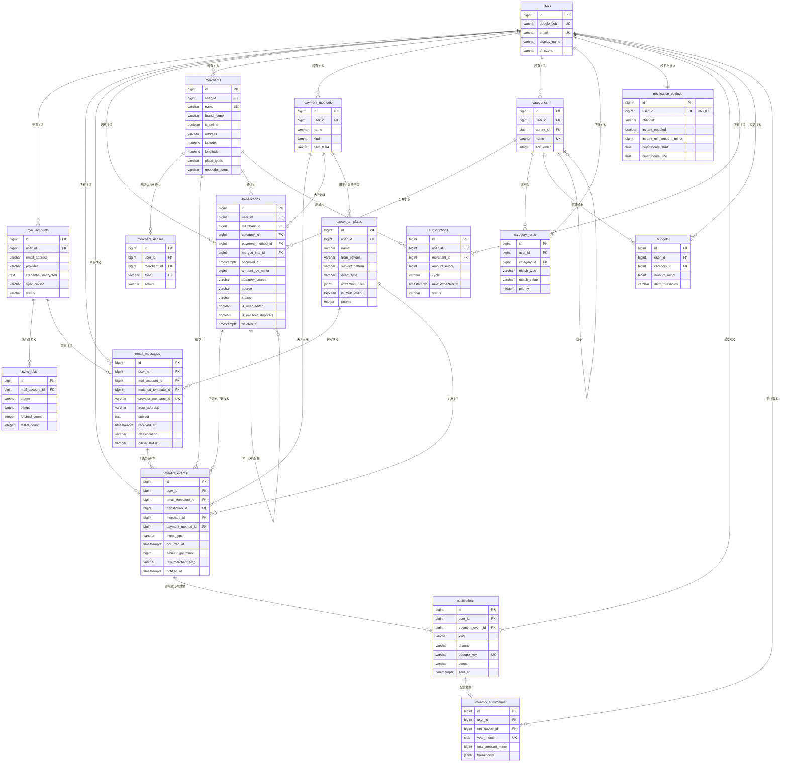
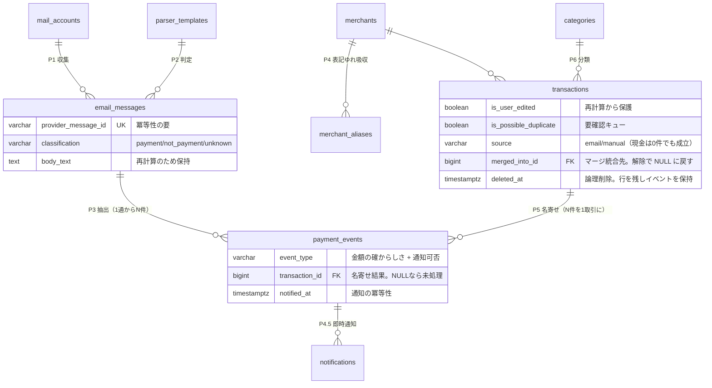

# ER 図

サービス名: 決済メール解析による自動家計簿サービス
対応する仕様書: [step2-db-spec.md](./step2-db-spec.md)

> ドラフト版。Mermaid で作成。draw.io での清書はスキーマ確定後に行う。

---

## 1. 全体 ER 図

---

## 2. 中核部分の ER 図（説明用）

`users` への線を省き、**データが流れる 3 層構造**だけを取り出したもの。
メンタリングではこちらを使って説明する。

---

## 3. リレーションの要点

| リレーション | 多重度 | 理由 |
|---|---|---|
| `email_messages` → `payment_events` | **1 — N** | 銀行のまとめ通知やカードの月次確定明細は、1 通に複数の決済が含まれる |
| `transactions` → `payment_events` | **1 — N** | 同じ買い物が EC 側とカード側から 2 通のメールを発生させるため、複数イベントを 1 取引に束ねる |
| `payment_events` → `transactions` | **N — 1** | 1 つの決済イベントが属する取引は必ず 1 つ。**中間テーブルは不要** |
| `merchants` → `merchant_aliases` | 1 — N | 「AMAZON.CO.JP」「AMZN Mktp JP」などの表記ゆれを 1 店舗に集約する |
| `users` → `notification_settings` | **1 — 1** | 通知設定はユーザにつき 1 行（`UNIQUE(user_id)`） |
| `categories` → `categories` | 自己参照 | カテゴリの親子関係 |
| **`transactions` → `transactions`** | **自己参照** | `merged_into_id` でマージの統合先を指す。統合元は論理削除で残し、`unmerge` で復元できるようにする |
| `transactions` → `payment_events` | **0 も許容** | 現金など手動入力の取引は、紐づくイベントを持たない |

---

## 4. 補足

- **`payment_events.transaction_id` が NULL** の行は「まだ名寄せされていないイベント」を表す。
  名寄せバッチはこの条件で対象を拾う。
- **`transactions` は論理削除（`deleted_at`）**。物理削除すると `transaction_id` が
  SET NULL になってイベントが「未名寄せ」に戻り、次のバッチで**同じ取引が再生成される**。
  行を残してイベントを保持させることでこれを防いでいる。
- **マージ解除**は、統合元の `deleted_at` と `merged_into_id` を NULL に戻し、
  決済イベントを付け替えることで実現する。統合元を物理削除しないのはこのため。
- **`transactions` は自前のフィールドを持つ**ため、名寄せロジックを変更して全件を再計算しても、
  `is_user_edited = true` の行は影響を受けない。
- ジオコーディングの結果（住所・緯度経度・店舗種別）は `transactions` ではなく `merchants` に持つ。
  同じ店舗の取引が何件あっても、外部 API の呼び出しは 1 回で済む。
