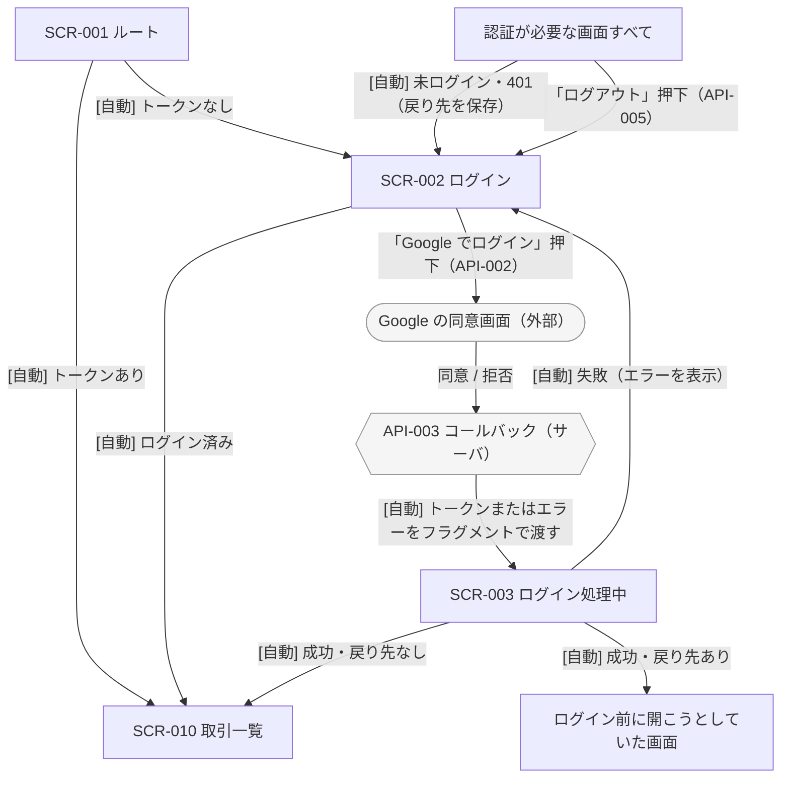
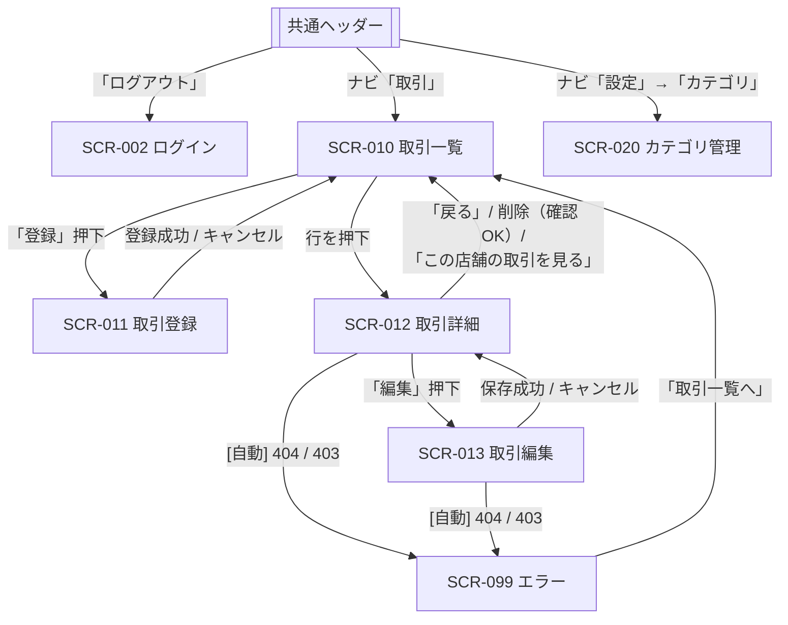
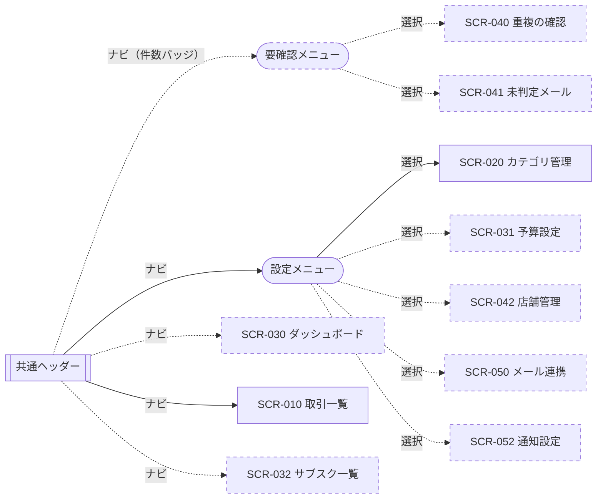
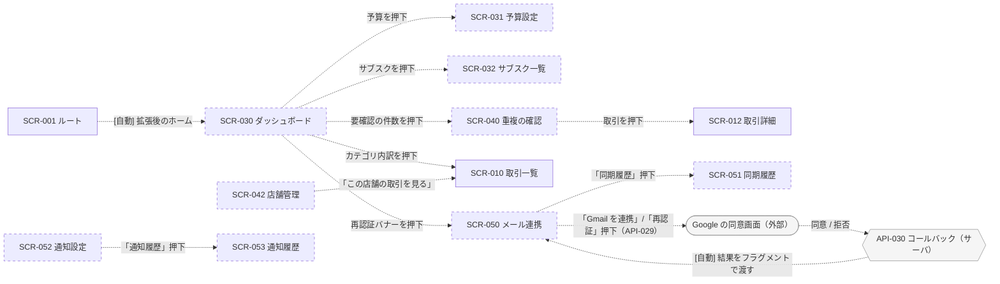

# 画面遷移図

サービス名: 決済メール解析による自動家計簿サービス
対応する画面一覧: [step4-screens.md](./step4-screens.md)

> - ER 図と同じく **Mermaid** で作成している（GitHub 上でそのまま図として表示され、差分もテキストで追えるため）
> - 図が 1 枚だと線が交差して読めなくなるため、**認証まわり / コア / 拡張を含む全体**に分けた
> - 遷移の契機は線のラベルに書く。`[自動]` はユーザ操作なしで遷移するもの、それ以外はボタン・リンクの押下
> - 画面内で完結する操作（絞り込み・ダイアログ）は図に描かず、4 章の表に記載する
> - 拡張（Step 8 以降）の画面と遷移は**点線**で示す

---

## 1. 認証まわり（ログイン・未ログイン時の扱い）

| 観点 | 設計 |
|---|---|
| 認証が必要な画面 | SCR-001 / SCR-002 / SCR-003 / SCR-099 **以外のすべて** |
| 未ログインで開いた場合 | SCR-002 へ遷移する。開こうとしていた URL を戻り先として保存し、ログイン後にそこへ戻す |
| 利用中にトークンが切れた場合 | どの画面でも API が `401 TOKEN_EXPIRED` を返したら、トークンを破棄して SCR-002 へ（「有効期限が切れました」と表示）。戻り先の扱いは同上 |
| ログイン済みで SCR-002 を開いた場合 | SCR-010 へ |
| Google で拒否した場合 | API-003 がエラーをフラグメントで SCR-003 へ渡し、SCR-003 が SCR-002 へ戻してメッセージを出す（**Step 6 で API-003 に追加する挙動**。[提出物](./step4-submission.md) 0 章） |

---

## 2. コア（Step 6 で実装する範囲）

---

## 3. 全体（拡張を含む）

コアの画面どうしの遷移は 2 章のとおりのため省略する。
拡張で画面が 10 増えるため、**ナビゲーションから到達できる画面（3.1）**と**画面から画面への遷移（3.2）**に分けて描く。
画面内で完結する操作（マージ・マージ解除・判定の教示など）は 4 章の表に記載する。

### 3.1 ナビゲーションから到達できる画面

> コアの段階では、ナビは「取引」と「設定 → カテゴリ」の 2 つだけになる（実線）。

### 3.2 画面から画面への遷移

---

## 4. 遷移の一覧

図のラベルだけでは書ききれない条件を補う。

### コア

| 遷移元 | 契機 | 遷移先 | 条件・補足 |
|---|---|---|---|
| SCR-001 | 自動 | SCR-010 | トークンがあり、API-004 が `200` |
| SCR-001 | 自動 | SCR-002 | トークンがない、または API-004 が `401` / `404` |
| SCR-002 | 「Google でログイン」押下 | Google → API-003 → SCR-003 | fetch ではなく**ブラウザごと遷移**する（`/api/v1/auth/google` をプロキシ経由で開く） |
| SCR-002 | 自動 | SCR-010 | ログイン済みで開いた |
| SCR-003 | 自動 | 戻り先 / SCR-010 | トークンを保存し、API-004 で確認できた |
| SCR-003 | 自動 | SCR-002 | フラグメントに `error` がある、またはトークンがない |
| 認証が必要な全画面 | 自動 | SCR-002 | 未ログイン、または API が `401` を返した。戻り先を保存する |
| 共通ヘッダー | 「ログアウト」押下 | SCR-002 | API-005 の結果にかかわらずトークンを破棄する |
| SCR-010 | 行を押下 | SCR-012 | - |
| SCR-010 | 「登録」押下 | SCR-011 | - |
| SCR-010 | 絞り込みを変更 | SCR-010 | URL のクエリを書き換えて再取得（ブラウザの「戻る」で前の条件に戻れる） |
| SCR-011 | 「登録」押下 | SCR-010 | API-011 が `201`。「登録しました」を表示 |
| SCR-011 | 「登録」押下 | SCR-011 | API-011 が `400` / `404`。エラーを表示して留まる |
| SCR-011 | 「キャンセル」押下 | SCR-010 | 入力途中なら確認ダイアログを出す |
| SCR-012 | 「編集」押下 | SCR-013 | - |
| SCR-012 | 削除（確認ダイアログで OK） | SCR-010 | API-014 が `204`。`409 ALREADY_MERGED` ならダイアログ内にエラーを出して留まる |
| SCR-012 | 「戻る」押下 | SCR-010 | ブラウザの履歴を戻る（絞り込み条件が保たれる） |
| SCR-012 | 「この店舗の取引を見る」押下 | SCR-010 | `?merchant_id=…` を付ける |
| SCR-012 / SCR-013 | 自動 | SCR-099 | API-012 が `404` / `403` |
| SCR-013 | 「保存」押下 | SCR-012 | API-013 が `200` |
| SCR-013 | 「キャンセル」押下 | SCR-012 | 入力途中なら確認ダイアログを出す |
| SCR-020 | 各ボタン押下 | SCR-020 | 作成・編集・削除はダイアログで行い、画面は移動しない |
| SCR-099 | 「取引一覧へ」押下 | SCR-010 | - |

### 拡張

| 遷移元 | 契機 | 遷移先 | 条件・補足 |
|---|---|---|---|
| SCR-001 | 自動 | SCR-030 | 拡張後はホームをダッシュボードに切り替える |
| SCR-030 | カテゴリ内訳を押下 | SCR-010 | `?category_id=…&from=…&to=…`（表示中の月）を付ける。「未分類」の内訳なら `category_id=none` |
| SCR-030 | 予算・サブスク・要確認件数を押下 | SCR-031 / SCR-032 / SCR-040 | - |
| SCR-030 | 再認証バナーを押下 | SCR-050 | API-004 の `needs_reauth` が `true` のときだけ出す |
| SCR-040 | 取引を押下 | SCR-012 | - |
| SCR-040 | マージ（確認ダイアログで OK） | SCR-040 | API-015 の後、一覧を再取得する |
| SCR-012 | 「マージ解除」押下 | SCR-012 | API-016 の後、詳細を再取得する |
| SCR-042 | 「この店舗の取引を見る」押下 | SCR-010 | `?merchant_id=…` を付ける |
| SCR-050 | 「Gmail を連携」「再認証」押下 | Google → API-030 → SCR-050 | API-029 で受け取った認可 URL へブラウザごと遷移する |
| SCR-050 | 自動 | SCR-050 | API-030 から戻ったとき、フラグメントの結果（成功 / エラー）を表示する |
| SCR-050 | 「同期履歴」押下 | SCR-051 | `?mail_account_id=…` を付ける |
| SCR-052 | 「通知履歴」押下 | SCR-053 | - |
