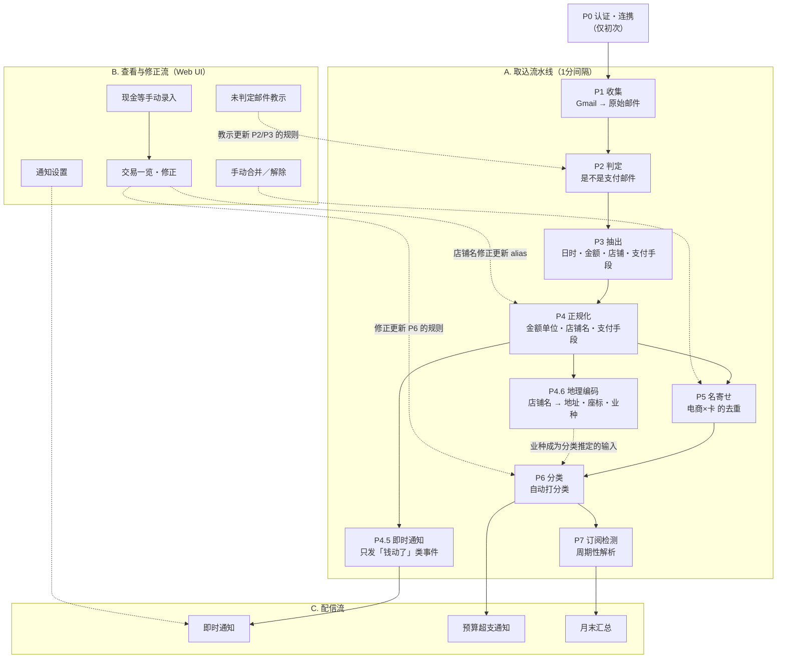

# Step0：流水线梳理

> 中文参考版。正本：[../step0-pipeline.md](../step0-pipeline.md)（日文）

选题：[通过解析支付邮件实现的自动记账服务](./theme-kakeibo.md)（Go）
定位：**不是提交物**。是 DB 仕様書、ER 図、API 仕様書全部的根据。

> 这份文档要定的事
> 1. 数据从 Gmail 到通知、到月末汇总，**要经过哪几道工序**
> 2. 每道工序的 **输入 / 处理 / 输出 / 幂等性 / 失败时怎么办**
> 3. 由此推出 **需要哪些表**（→ Step1）
> 4. 由此推出 **需要哪些画面和 API**（→ Step3）

---

## 0. 这个 app 的形式

**不是「记账 app」，是「流水线 + 校对台」。**

一般记账 app 的核心是输入界面，而本 app **不存在输入界面**。
这正是提案时问题定义的直接答案：「手动输入型难以坚持，几周就不用了」。

界面的作用只有三件：

1. **看结果** —— 月度分类明细、订阅一览、预算余额
2. **改机器做错的地方** —— 疑似重复确认、未判定邮件教示、分类修正
3. **补机器看不见的东西** —— 现金交易手动录入

**和用户的主要接触点是通知（推），不是画面（拉）。**

| | sns-camp（讲座样例） | 本 app |
|---|---|---|
| 数据来源 | 用户输入 | 外部（邮件） |
| 主要处理 | CRUD | 流水线 |
| UI 的作用 | 价值本身 | 确认与订正 |
| 使用频率 | 每天 | 每次收到通知 + 每月几次 |
| 主要输出 | 画面 | 通知邮件 |
| **故障的样子** | 错误页面 | **数据静悄悄地不对** |

最后一行很重要。**本 app 的故障是无声的。** 卡公司改了邮件模板 → 解析失败 →
那张卡的支出不再被记录 → **因为不知道本该有什么，所以察觉不到。**

→ **可观测性不是运维话题，是产品功能**（→ 接 Step12 非機能要件）。

---

## 1. 全局

分成三条流。

| 流 | 启动方式 | 性质 |
|---|---|---|
| **A. 取込流水线** | 定时执行（1 分间隔）／手动触发 | 异步・幂等・可重跑 |
| **B. 查看与修正流** | Web UI 上的用户操作 | 同步・CRUD |
| **C. 配信流** | 检测到支付时／超过阈值时／月末排程 | 异步・有副作用（发通知） |



**关键性质**：B（用户的修正）会反馈进 A（自动处理）的规则。
这是对「手动输入坚持不下去」这个问题的答案——设计成**越修正越自动**。

---

## 2. 取込流水线 各工序

### P0. 认证・连携（仅初次）

| 项目 | 内容 |
|---|---|
| 输入 | 用户操作 |
| 处理 | ① 登录本 app ② 连携 Gmail 账号 |
| 输出 | `users` / `mail_accounts`（token 加密保存） |

**对设计的含意**

- **认证有两种**，别混为一谈。
  - **app 认证**：使用本 app 的权利（Bearer / JWT）
  - **Gmail 连携认证**：读邮件的权利（Google OAuth / IMAP 应用密码）
- 一个用户可能连携多个邮箱 → `users` 1 — N `mail_accounts`
- Gmail `readonly` 是 **restricted scope**。停在 Testing 状态的话 refresh token 会短期失效，
  所以取込层的实现方式要从 3 案里选（→ 6. 未决事项 ①）
- **schema 按多租户设计（所有业务表带 `user_id`），运营按单用户跑。**
  事后补 `user_id` 代价很高，所以一开始就加。

---

### P1. 收集（Fetch）

| 项目 | 内容 |
|---|---|
| 输入 | `mail_accounts` + 上次同步位置（游标） |
| 处理 | 从 Gmail 取邮件。初次**回填过去 12〜24 个月**，之后只取增量 |
| 输出 | `email_messages`（原始数据） |
| 执行间隔 | **1 分钟**（为了即时通知。→ 6. 未决事项 ①） |
| 幂等性 | **Gmail message ID 加 UNIQUE 约束**。重复取也不会多出行 |
| 失败时 | 中途失败也保留已取到的部分。**游标只在成功时前进** |
| 执行记录 | `sync_jobs`（开始/结束时刻、状态、取得件数、游标前后、错误内容） |

**对设计的含意**

- 初次回填是必须的，两个理由：
  - **技术理由**：P7 订阅检测没有历史就跑不起来
  - **产品理由**：连携完成的瞬间就是「过去 12 个月的账本做好了」。
    别的记账 app 第一天是空的，**这是最大的差异点，也是发表时的高光**。
- `email_messages` **保留原始数据**。后段（P2〜P6）逻辑改了要能全量重算——这是整个设计的前提。
- 保存项目：发件人、收件人、标题、接收时刻、正文（text / html）、Gmail message ID。
  正文保留到什么程度是隐私和容量的取舍（→ 6. 未决事项 ②）
- **1 分钟跑一次，`sync_jobs` 一天会有 1440 行。**
  无变化的执行要么不记录，要么写到轻量的另一张表（→ 6. 未决事项 ⑤）

---

### P2. 判定（是不是支付邮件）

| 项目 | 内容 |
|---|---|
| 输入 | `email_messages` 中未判定的 |
| 处理 | 发件人地址 + 标题模式，与 `parser_templates` 匹配 |
| 输出 | `email_messages.classification` = `payment` / `not_payment` / `unknown` |
| 幂等性 | 判定是纯函数。规则变了可以重判 |

**三段匹配**

1. **发件人地址** allowlist（高精度・第一段）
2. **标题模式**（排除同一发件人的促销邮件。例：楽天カード 既发利用通知也发广告）
3. 两个都不中 → **作为 `unknown` 保留，不丢弃**

**对设计的含意**

- 小山さん的指摘「判定一封邮件是不是支付邮件，可能有点难」的答案就是**第 3 段**。
  不追求完美的自动判定，而是**把漏网的放到 UI 上让用户教**（→ B2 画面）。
- 误判成 `not_payment` 会永远发现不了，所以**拿不准就倒向 `unknown`**。

---

### P3. 抽出（Extract）

| 项目 | 内容 |
|---|---|
| 输入 | `classification = payment` 的邮件 + 匹配上的 `parser_templates` |
| 处理 | 套用模板的抽出规则（正则 / HTML 选择器） |
| 输出 | `payment_events`（日时・金额・货币・原始店铺名・支付手段线索・事件种别） |
| 失败时 | 记录抽出失败并放进 `unknown` 队列。**一封失败不能让整次执行挂掉** |

**对设计的含意（重要）**

- **一封邮件可能产出多条支付事件。**
  例：银行的出入金汇总通知、卡公司的月度确定明细。
  → `email_messages` **1 — N** `payment_events`
- **要有事件种别。** 这是 P5 金额可信度判定 和 P4.5 即时通知对象筛选 **两处共用的核心列**。

  | event_type | 例 | 金额可信度 | 即时通知 |
  |---|---|---|---|
  | `order_confirm` | 电商订单确认 | 低（之后会变） | ❌ 钱还没动 |
  | `usage_notice` | 卡利用速报 | 中（未确定） | ✅ |
  | `settlement` | 卡确定明细 | **高** | ❌ 速报时已通知 |
  | `receipt` | 订阅收据 | 高 | ✅ |
  | `bank_debit` | 银行扣款通知 | 高 | ✅ |

**日文邮件特有的处理**

- 字符编码：**ISO-2022-JP** 还活着。Go 标准库读不了，需要 `golang.org/x/text/encoding/japanese`
- 传输编码：quoted-printable / base64
- HTML 邮件（金额在表格里）→ 转文本
- 全角数字金额（`１，２３４円`）

**模板怎么造（AI 的用法）**

> 对遠藤さん评论「是硬来正规化，还是甩给 AI」的回答。

**AI 用在生成模板时，不用在运行时。**

```
检测到未知发件人
  → 让 LLM 生成「从这封邮件抽出日时・金额・店铺的规则」
  → 人工 review 一次
  → 存进 parser_templates
  → 之后运行时走确定性解析（不调 LLM）
```

好处：
- 成本几乎为零（只按发件人种类数调用）
- 可测试、可复现
- **不用每天把个人金融数据往外部 LLM 送**

---

### P4. 正规化（Normalize）

| 项目 | 内容 |
|---|---|
| 输入 | `payment_events`（刚抽出的） |
| 处理 | 把金额・日时・店铺名・支付手段统一成系统内的表示 |
| 输出 | `payment_events` 的正规化列 + `merchants` / `merchant_aliases` 的更新 |

**四种正规化**

| 对象 | 处理 |
|---|---|
| 金额 | **`bigint` 存最小单位**（日元 1 = 1円）。不用浮点。外币用「原货币 + 原金额 + 日元换算额」三件套 |
| 日时 | 带时区保存。**「算哪个月的支出」按 JST 判定** |
| 店铺名 | 原始字符串 → 查 `merchant_aliases` → 没有就正规化后新建 `merchants` 并挂 alias |
| 支付手段 | 用模板 + 邮件中的卡尾 4 位等解析出 `payment_methods` |

**店铺名正规化要做的**

- 全角 → 半角、大小写统一、符号空白压缩
- 去掉法人格（`株式会社` / `(株)` / `カ)`）
- 去掉收单方来的前后缀（`SQ *` / `PAYPAL *` / `AMZN Mktp JP` / 末尾店铺代码）

**merchant 的粒度（重要的设计判断）**

`merchants` 一行是**支店单位**，用 `brand_name` 列把连锁绑在一起。

| id | brand_name | name | address | place_types |
|---|---|---|---|---|
| 1 | セブン-イレブン | セブン-イレブン渋谷道玄坂店 | 渋谷区… | convenience_store |
| 2 | セブン-イレブン | セブン-イレブン新宿三丁目店 | 新宿区… | convenience_store |

- 地图能按支店画
- 「这个月在 7-11 花了多少」用 `GROUP BY brand_name`
- **分类规则挂在 `brand_name` 上** → 教一次，全支店生效

正规做法是拆出 `brands` 表，但考虑表数量和「1 Step 1 週間」的约束，这次**用列**。
这个取舍本身就是「設計判断」的素材。

**对设计的含意**

- **`merchants` 和 `merchant_aliases` 拆开**是关键。
  「アマゾン ジャパン」「AMAZON.CO.JP」「AMZN Mktp JP」指向同一行 `merchants`。
  这张 alias 表直接决定 **P5 名寄せ 的精度和 P4.6 的 API 调用次数**。
- 用户在 UI 上改了店铺名 → 重挂 alias → 下次自动正确（反馈回路）

---

### P4.5 即时通知（Notify）

> 为了「花的当下就自觉」。和月末汇总（P8）职责不同，**两个都要**。

| 项目 | 内容 |
|---|---|
| 输入 | 已正规化且未通知的 `payment_events` |
| 处理 | 按事件种别筛选对象，套用 `notification_settings` 后发送 |
| 输出 | 发送通知 + `notifications`（发送历史）+ `payment_events.notified_at` |
| 幂等性 | 靠 `notified_at` 防止重复发送 |
| 失败时 | 记录发送失败，下次执行重试。太旧的就放弃（通知必须新鲜） |

**为什么放在 P5 名寄せ 之前**

名寄せ 因为电商和卡的事件会错开几天，等确定的话通知会晚好几天。
要在「钱动的瞬间」通知，就不能等 名寄せ。

作为代价，**只发 `event_type` 属于「钱动了」类的事件**（见上表）来防止重复通知。
如果用 `order_confirm`（电商订单确认）通知，几天后的卡利用速报会把同一笔再通知一遍。

**通知内容**

```
💳 ¥580  セブン-イレブン渋谷道玄坂店
        渋谷区道玄坂1-x-x
        信用卡 ****1234
        [在 app 里看详情]
```

地址在 P4.6 取到了就带上，没取到就省略（不设为必需）。

**通知疲劳对策**（由 `notification_settings` 控制）

- 最低金额阈值（例：¥500 以下不通知，或按日合并）
- 静音时段（深夜不发）
- 按渠道开关

---

### P4.6 地理编码（Geocode）

| 项目 | 内容 |
|---|---|
| 输入 | 新建的 `merchants`（`geocode_status = pending`） |
| 处理 | 用店铺名查 Places API，取地址・经纬度・店铺种别 |
| 输出 | `merchants` 的位置信息列 |
| 调用频率 | **不是每笔交易，而是每个店铺 1 次**。一年 100 家左右，在免费额度内 |
| 失败时 | 记 `not_found`，不阻塞流水线（best effort） |

**对设计的含意**

- `merchants` / `merchant_aliases` 拆开的设计在这里又见效了。alias 已经归一，
  所以一个真实店铺只调 1 次 API。
- **能回溯适用于历史数据。** 初次回填的 12 个月交易，只要填好店铺主数据就一次性都有地址了。
- **副作用：提升分类精度。**
  Places API 会返回店铺种别（`convenience_store` / `restaurant` / `gas_station` 等），
  把它喂给 P6 就**解决了新店铺的冷启动分类问题**。
- 线上支付（电商）标记为 `skipped`。本来就不存在「花钱的地点」。
- 取得率到不了 100%。`SQ *` / `PAYPAL *` 这类收单方描述符、个人小店查不到。
  **做成「取到就显示」，不设为必需项。**

---

### P5. 名寄せ（Reconcile）—— **本项目的核心兼最难关**

| 项目 | 内容 |
|---|---|
| 输入 | 未关联的 `payment_events` + **回溯期内已有的 `transactions`** |
| 处理 | 候选生成 → 打分 → 阈值判定 |
| 输出 | `transactions` + `transaction_links` |

**为什么需要**：一笔购买会从电商侧和卡侧各产生一封邮件，导致重复计入。

**候选生成条件**（放宽一点，广撒网）

- 同一用户
- 金额一致，或在容差内
- 发生日时在 **±数日以内**（不是分钟级 ← 见下）
- 事件来源不同（电商 ⇔ 卡）

**打分要素**

| 要素 | 权重 | 备注 |
|---|---|---|
| 金额完全一致 | 大 | 但不一致的情况很多（见下） |
| 正规化后店铺名相似度 | 大 | `merchant_aliases` 在这里见效 |
| 时刻接近度 | 中 | 越近加分越多 |
| 支付手段一致性 | 小 | |

**按阈值三分支**

| 分数 | 行为 |
|---|---|
| 高 | 自动合并 |
| 中 | **打「疑似重复」标记，请用户确认** |
| 低 | 当作不同交易 |

**现实的难处（把方针倒向保守的根据）**

- **时刻会错开**：电商在下单时，卡在发货时扣款。差几天是常态
- **金额对不上**：积分抵扣、分批发货、外币换算、分期
- **店铺名是两码事**：卡侧是收单方描述符，电商侧是正式店名

→ **误合并比漏合并更糟**（看起来钱凭空消失，会失去对整个 app 的信任）。
阈值保守设，拿不准就倒向「疑似重复」。

**按可信度采用金额**

同一笔交易挂了多个事件时，采用 `event_type` 可信度高的那个。

```
settlement / receipt / bank_debit  >  usage_notice  >  order_confirm
```

**为了守住可重跑性的设计**

- `transactions` 持有**自己的字段**（金额・日时・店铺・分类・备注）。
  不设计成「引用代表事件」。
- 理由：改了 名寄せ 逻辑做全量重算时，**用户的手动修改不能被抹掉**。
  → `transactions` 上带「用户已编辑 / 锁定」标记，重算时跳过
- 支持手动合并・解除合并
- `payment_events` **N — N** `transactions`，用 `transaction_links` 表达

**时间不够时的降级方案**

> 不做打分，只做「金额相同 & 3 天以内 → 标记为疑似重复，用户点一下确认」。
> 工数一成拿到价值七成，演示效果也不变。

---

### P6. 分类（Categorize）

| 项目 | 内容 |
|---|---|
| 输入 | 未设分类的 `transactions` |
| 处理 | 按优先级评估 `category_rules`（店铺 → 品牌 → 店铺种别 → 关键词 → 默认） |
| 输出 | `transactions.category_id` + **是怎么定的**（`rule` / `place_type` / `user` / `default`） |

**学习回路**

```
用户修正交易的分类
  → 对该品牌 upsert 一条 category_rule
  → 之后该品牌的全部支店自动正确分类
```

**对设计的含意**

- 不存「是怎么定的」，就会**用规则覆盖掉用户的修改**。必须存。
- 用 P4.6 拿到的店铺种别，**一次都没见过的店铺也能第一次就分对**。
- 分不出来的落到 `未分類`，排在一览最前面（免得被放着不管）

---

### P7. 订阅检测（Subscription detection）

| 项目 | 内容 |
|---|---|
| 输入 | 最近 13 个月的 `transactions`，按（店铺, 金额）分组 |
| 处理 | 把发生日排序算间隔，判定周期性（月次 28〜31 天 / 年次 365±10 天，3 次以上） |
| 输出 | `subscriptions`（店铺・金额・周期・首次・最后・下次预测日・状态） |

**状态迁移**

```
active ──(过了下次预测日 + 宽限期仍无扣款)──> 疑似停止 ──(用户确认)──> 已解约
```

**对设计的含意**

- 前提是 P1 的回填。没有历史什么都检测不出来
- 对「忘记解约察觉不到」这个问题真正见效的**不是疑似停止，而是「持续中一览」的可视化**。
  月末汇总里必须放。

---

### P8. 汇总・配信（Aggregate & Deliver）

| 种别 | 工序 | 触发 | 目的 |
|---|---|---|---|
| **即时通知** | P4.5 | 检测到支付事件 | **自觉**（花的当下就知道） |
| **预算超支通知** | P8 | 当月累计超过阈值 | 抑制 |
| **月末汇总** | P8 | 月末排程 | **回顾**（分类明细 + 环比上月 + 持续中订阅） |

三种共用 `notification_settings` / `notifications`。

**对设计的含意**

- 即时通知和月末汇总**职责不同，所以两个都留**。不往一边倒。
- 预算超支通知是 **遠藤さん点名要的**（「不错，也希望能通知预算超支」）。
  实现成本低价值高，放进 MVP。
- 需要状态管理来**避免同一阈值反复通知**（因为每次取込都会跑）。
  → 记录「该月・该阈值已通知」
- 月末汇总也要有配信记录（防重发）

---

### 手动录入路径（现金等）

没有通知手段的支付不经过 `payment_events`，**由用户直接创建 `transactions`**。

→ **`transactions` 允许挂 0 条 `payment_events`**。这不是「允许 NULL」，是设计上的正常情况。

---

## 3. 横向的设计方针

| 方针 | 内容 |
|---|---|
| **保留原始数据** | 不删 `email_messages`。后段逻辑改了要能全量重算 |
| **三层分割** | `email_messages`（原始） → `payment_events`（抽出单位） → `transactions`（实际交易） |
| **幂等性** | Gmail message ID 的 UNIQUE 约束。各工序靠游标 / 状态列只捡「未处理的」 |
| **通知唯一性** | 靠 `notified_at` / 通知记录，重跑也不会重复通知 |
| **失败局部化** | 一封解析失败、一次地理编码失败，不能让整次执行挂掉 |
| **保护用户编辑** | 手改过的行不参与重算，用标记管理 |
| **反馈** | 用户的修正必须回流成规则（模板 / alias / 分类） |
| **多租户设计** | 所有业务表带 `user_id`。运营是单用户，但设计上先分离 |
| **金额** | `bigint` 最小单位 + 货币代码。不用浮点 |
| **时刻** | 带时区保存，汇总按 JST |
| **best effort 项目** | 地址・座标是「取到就显示」，不设为必需项 |
| **隐私** | token 加密保存。正文不写日志。LLM 只在生成模板时用 |
| **可观测性** | 检测无声故障。同步历史、按发件人的接收件数、中断检测 |

---

## 4. 流水线 → 表（交给 Step1）

| 工序 | 需要的表 |
|---|---|
| P0 认证・连携 | `users`, `mail_accounts` |
| P1 收集 | `email_messages`, `sync_jobs` |
| P2 判定 | `parser_templates`（判定条件） |
| P3 抽出 | `parser_templates`（抽出规则）, `payment_events` |
| P4 正规化 | `merchants`, `merchant_aliases`, `payment_methods` |
| P4.5 即时通知 | `notification_settings`, `notifications` |
| P4.6 地理编码 | `merchants`（追加位置信息列） |
| P5 名寄せ | `transactions`, `transaction_links` |
| P6 分类 | `categories`, `category_rules` |
| P7 订阅检测 | `subscriptions` |
| P8 汇总・配信 | `budgets`, `monthly_summaries`, `notifications` |

→ **核心 15 张表 + 扩展 3 张表**。详见 [step2-checklist.md](./step2-checklist.md)

---

## 5. 流水线 → 画面（交给 Step3 / Step4）

| 画面 | 来自的工序 | 主要操作 |
|---|---|---|
| 仪表盘 | P6 / P7 / P8 | 当月合计・分类明细・预算余额・订阅件数・待确认件数 |
| 交易一览 | P5 / P6 | 按期间・分类・支付手段筛选，修正，删除 |
| 交易详情 | P3 / P5 / P4.6 | 查看来源邮件（多封）、解除合并、确认店铺位置 |
| 疑似重复确认 | P5 | 回答「是同一笔购买吗？」 |
| 未判定邮件 | P2 | 教「是/不是支付」，创建模板 |
| 手动录入 | — | 登记现金交易 |
| 订阅一览 | P7 | 确认持续中的，标记已解约 |
| 月末汇总 | P8 | 分类明细・环比上月 |
| 通知设置 | P4.5 / P8 | 渠道、最低金额、静音时段 |
| 通知历史 | P4.5 / P8 | 已发送通知一览 |
| 同步状况 | P1 | 执行历史、按发件人接收件数、中断检测（可观测性） |
| 设置 | P0 / P8 | 邮箱连携、预算设置、配信目标・配信时刻 |
| （可选）支出地图 | P4.6 | 在地图上显示支出。演示效果好但优先级低 |

---

## 6. 未决事项（メンタリング 时问讲师）

1. **Gmail 取込的实现方式** —— ① Gmail API + OAuth（正统但 Testing 状态 token 短期失效）／② 用 GAS 只做取邮件部分（小山さん的提案，摩擦最小）／③ IMAP + 应用密码（全部用 Go 完成）。**因为即时通知要 1 分钟跑一次**，常驻进程还是外部调度器也在这里一并定
2. **邮件正文保留到什么程度** —— 重解析的必要性 vs 隐私和容量
3. **`transactions` 的未确定 / 确定怎么处理** —— 利用速报和确定明细金额会变。是加状态列，还是用可信度高的事件覆盖
4. **通知渠道** —— 邮件（复用既有基盘，成本最小）／ Slack Incoming Webhook（实现容易体验好）／ PWA Web Push（体验最好但成本大）。※ LINE Notify 已于 2025 年 3 月终止服务，不能用（需确认）
5. **`sync_jobs` 的粒度** —— 1 分间隔一天 1440 行。是否记录无变化的执行，还是分到轻量表
6. **批处理的运行基盘** —— 常驻进程（ECS Fargate 常时启动）还是 EventBridge + Lambda / ECS Scheduled Task。1 分间隔要和成本一起权衡（前提是用 Credit-tech 的 PoC 环境）
7. **地理编码 API** —— Google Places API（收费但日本店铺名检索强）／ OSM Nominatim（免费但对日本店铺名弱）。包括 API key 的管理方式
8. **LLM 能不能用** —— 用 Bedrock 生成模板的话，涉及个人金融数据，需要确认公司策略
9. **订阅是用表存还是每次检测** —— 想带状态（已解约等）就需要表

---

## 7. 后续再议（本次范围外）

### 用 GPS 取位置

**内容**：收到支付通知的时点取手机 GPS，记录实际所在的位置。

**这次不做的理由**

1. **技术制约**：Service Worker 里调不了 `navigator.geolocation`
   （Geolocation API 只存在于 Window 上下文，`WorkerNavigator` 上没有）。
   因此「推送到达时后台自动取位置」用 Web 技术做不到，
   **必须由用户点一下通知**这个主动操作。
   要做到全自动就得上原生 app，但 Step4〜6 是 Web 前端，超出范围。
2. **实现成本**：需要 PWA 化 + Web Push + 定位权限，会压迫 Step6。
   本 app 里需要 PWA 的功能只有这一个。
3. **替代手段够用**：P4.6 的店铺名地理编码不需要权限也不需要用户操作，
   而且**能回溯适用于历史数据**。「在哪花的」大部分靠它就能满足。

**重新考虑的条件**

实际运行中发现 `geocode_status = not_found` 的比例很高时。
（`SQ *` / `PAYPAL *` 这类收单方描述符、个人小店等从店铺名无法定位的情况）

**到那时需要的设计**

- `transactions` 加 `latitude` / `longitude` / `location_source`（`merchant_geocode` \| `gps` \| `manual`）/ `location_accuracy_m` / `location_captured_at`
- `POST /api/v1/transactions/{id}/location`
- **可信度判定**：只有邮件里的「利用日時」和当前时刻之差在阈值内（例：5 分钟）才采用 GPS
- **学习回路**：把 GPS 定位到的场所存进 `merchants`，
  以后同样的描述符不用 GPS 也知道在哪
  （从「每次都要点一下的负担」变成「新店教一次」）
