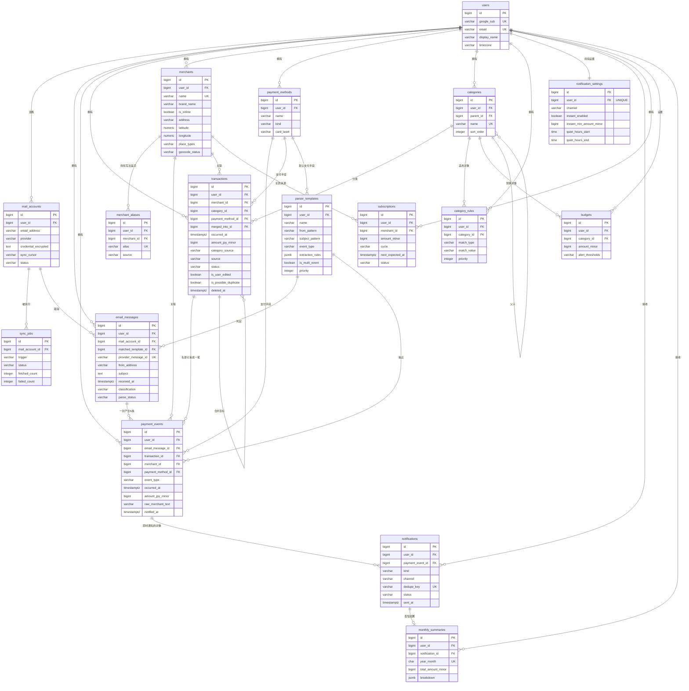
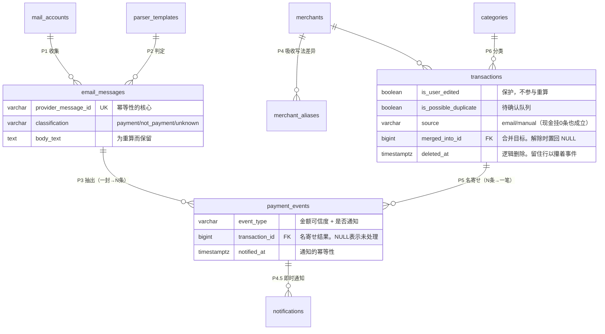

# ER 图

> 中文参考版。正本：[../step2-er.md](../step2-er.md)（日文，提交用）
> 表名、列名保持原样不翻译。

服务名：決済メール解析による自動家計簿サービス
对应规格书：[step2-db-spec.md](./step2-db-spec.md)

> 草案版。用 Mermaid 制作。draw.io 誊清等 schema 定稿后再做。

---

## 1. 全体 ER 图

---

## 2. 核心部分 ER 图（讲解用）

省掉连向 `users` 的线，只留下**数据流动的三层结构**。
**メンタリング 时用这张讲。**

---

## 3. 关系的要点

| 关系 | 多重度 | 理由 |
|---|---|---|
| `email_messages` → `payment_events` | **1 — N** | 银行的汇总通知、卡的月度确定明细，一封里含多笔支付 |
| `transactions` → `payment_events` | **1 — N** | 同一笔购买会从电商侧和卡侧各发一封邮件，要把多条事件束成一笔 |
| `payment_events` → `transactions` | **N — 1** | 一条支付事件所属的交易必定只有一个。**不需要中间表** |
| `merchants` → `merchant_aliases` | 1 — N | 把「AMAZON.CO.JP」「AMZN Mktp JP」等写法差异集约到一家店铺 |
| `users` → `notification_settings` | **1 — 1** | 通知设置一个用户一行（`UNIQUE(user_id)`） |
| `categories` → `categories` | 自引用 | 分类的父子关系 |
| **`transactions` → `transactions`** | **自引用** | 用 `merged_into_id` 指向合并目标。合并来源用逻辑删除保留，让 `unmerge` 能复原 |
| `transactions` → `payment_events` | **允许 0 条** | 现金等手动录入的交易，不挂任何事件 |

---

## 4. 补充

- **`payment_events.transaction_id` 为 NULL** 的行表示「还没被 名寄せ 的事件」。
  名寄せ 批处理就是按这个条件捡对象的。
- **`transactions` 用逻辑删除（`deleted_at`）**。物理删除的话 `transaction_id` 会变 SET NULL、
  事件回到「未名寄せ」，下次批处理**又生成一模一样的交易**。
  留住行让它继续攥着事件，就挡住了这个问题。
- **解除合并**是把合并来源的 `deleted_at` 和 `merged_into_id` 置回 NULL，
  再把支付事件挪回去。不物理删除合并来源就是为了这个。
- **`transactions` 持有自己的字段**，所以改了 名寄せ 逻辑做全量重算时，
  `is_user_edited = true` 的行不受影响。
- 地理编码的结果（地址・经纬度・店铺种别）放在 `merchants` 而不是 `transactions`。
  同一家店铺不管有多少笔交易，外部 API 只调用一次。
